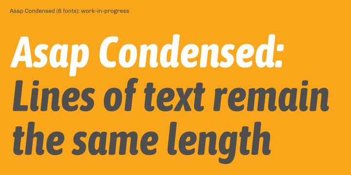

# Asap family

**Omnibus-Type**  
*SIL Open Font License, 1.1*

Asap Condensed offers a standarised character width on all styles, which means lines of text remain the same length. This useful feature allows users to change type styles on-the-go without reflowing a text body.

####Asap Condensed family contains:
* Regular/Italic
* Medium/Medium Italic
* SemiBold/SemiBold Italic
* Bold/Bold Italic

To contribute to the project contact [Omnibus-Type](http://omnibus-type.com/).

### Designers

* Pablo Cosgaya 
* Nicolas Silva

### License

Copyright (c) 2011-2016, Omnibus-Type (www.omnibus-type.com omnibus.type@gmail.com)

Licensed under the [*SIL Open Font License, 1.1*](http://scripts.sil.org/OFL); you may not use this file except in compliance with the License.

======
## FONTLOG for the Asap fonts

This file provides detailed information on the Asap Condensed font software.  
This information should be distributed along with the Asap fonts and any derivative works.

### Asap is a typeface family that supports the following Unicode language range: 

* Basic Latin 				U+0020-U+007E
* Latin-1 Supplement 		U+00A0-U+00FF
* Latin Extended-A 			U+0100-U+017F
* Latin Extended Additional*	U+1E00-U+1EFF *(111/256)

**Character map to support MS Codepages:**
* 1252 Latin-1
* 1250 Latin-2 (Easter Europe)
* 1254 Turkish
* 1257 Windows Baltic
* 1258 Vietnamese
* Mac Roman

*To contribute to the project contact Omnibus-Type at omnibus.type@gmail.com*

**2016 July 9 (v1.006) Added Semibold - Nicolás Silva Schwarzenberg**

- Add new Semibold instance (Medium 100 -> 92).
- Updated Copyright name registry

**2016 June 4 (v1.005) Initial Commit - Nicolás Silva Schwarzenberg**

- Initial Commit

### Acknowledgements

If you make modifications be sure to add your name (N), email (E), web-address
(if you have one) (W) and description (D). This list is in alphabetical order.

**N:** **Nicolas Silva Schwarzenberg**  
**E:** nsilva.design@gmail.com  
**W:** http://www.omnibus-type.com  
**D:** Typeface development  

**N:** **Pablo Cosgaya**  
**E:** omnibus.type@gmail.com  
**W:** http://www.omnibus-type.com  
**D:** Designer